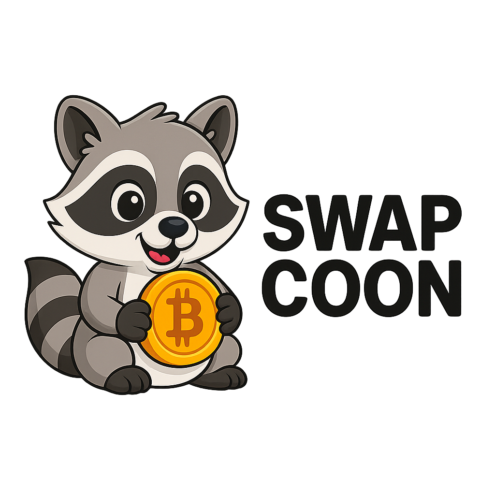

# ⚡ ExMachinaX - Premium Web3 Exchange Bot

> **Самый продвинутый Telegram бот для обмена криптовалют с мини-приложением нового поколения!**



## 🔥 **НОВЫЕ КРУТЫЕ ВОЗМОЖНОСТИ**

### 🎯 **ПРОФИЛЬ 2.0 - ГЕЙМИФИКАЦИЯ**
- **4 уровня пользователей**: Новичок → Трейдер → Про → VIP
- **Система достижений** с наградами и бейджами
- **Прогресс-бар** до следующего уровня
- **Персональные преимущества** для каждого уровня
- **Красивый аватар** из Telegram с уровневыми индикаторами

### 📊 **TRADING ДАШБОРД**
- **Live графики** объемов и операций (Chart.js)
- **Метрики в реальном времени**: объем, обмены, комиссии, рефералы
- **Рыночные данные** с изменениями за 24ч
- **Период анализа**: 7 дней / 30 дней
- **Красивые анимации** при загрузке данных

### 🏆 **СИСТЕМА ДОСТИЖЕНИЙ**
- **5+ уникальных достижений** с иконками и описаниями
- **Прогресс трекинг** в реальном времени
- **Награды и бонусы** за выполнение
- **Анимации получения** новых достижений
- **Статистика прогресса** с процентами

### ⚙️ **ПРОДВИНУТЫЕ НАСТРОЙКИ**
- **Персонализация**: тема, язык, уведомления
- **Безопасность**: 2FA, уровни приватности
- **Торговые предпочтения**: валюта отображения
- **Экспорт данных** для анализа
- **Красивые toggle переключатели**

### 🌐 **УМНЫЙ БРАУЗЕР**
- **Новости платформы** с типизацией (Feature/Security)
- **Полезные ссылки**: CoinMarketCap, CoinGecko, Etherscan
- **Обучающие материалы** по криптовалютам
- **Внешние ссылки** с hover эффектами

### 🚀 **БЫСТРЫЕ ДЕЙСТВИЯ**
- **4 главные кнопки** на стартовом экране
- **Hover анимации** с подъемом
- **Мгновенный переход** к нужным разделам
- **Красивые иконки** Font Awesome

---

## 📱 **СТРУКТУРА МИНИ-ПРИЛОЖЕНИЯ**

### **5 основных экранов:**

1. **🏠 Главная** - Калькулятор + быстрые действия
2. **📊 Дашборд** - Аналитика и графики
3. **📜 История** - Операции с фильтрами
4. **👤 Профиль** - Уровни, достижения, рефералы
5. **⚙️ Настройки** - Персонализация и безопасность

### **Дополнительные экраны:**
- **🏆 Достижения** - Система наград
- **🌐 Ресурсы** - Новости и полезные ссылки

---

## 💻 **ТЕХНИЧЕСКАЯ АРХИТЕКТУРА**

### **Backend (Node.js + Express):**
```
src/
├── bot.js              # Telegram бот с командами
├── web-server.js       # Express сервер + 12 API эндпоинтов
├── models/
│   └── Database.js     # SQLite с 6 таблицами
├── services/
│   ├── GoogleSheetsService.js  # Интеграция курсов
│   ├── AMLService.js          # Проверка адресов
│   └── CRMService.js          # Интеграция CRM
└── webapp/
    ├── index.html      # SPA приложение
    ├── styles.css      # 1500+ строк CSS
    └── app.js          # 800+ строк JavaScript
```

### **Frontend (Modern Web):**
- **Responsive Design** - Mobile First подход
- **Telegram Web App API** - Нативная интеграция
- **Chart.js** - Интерактивные графики
- **CSS Grid/Flexbox** - Современная верстка
- **Smooth Animations** - Плавные переходы
- **Dark/Light Theme** - Адаптивная тема

### **База данных (SQLite):**
```sql
- users              # Пользователи с уровнями
- orders             # Заявки на обмен
- referrals          # Реферальная система
- user_achievements  # Достижения пользователей
- user_settings      # Персональные настройки
- user_daily_stats   # Дневная аналитика
```

---

## 🎨 **ДИЗАЙН СИСТЕМА**

### **Цветовая палитра:**
- **Primary**: `#007AFF` (iOS Blue)
- **Success**: `#34C759` (Green)
- **Warning**: `#FF9500` (Orange)
- **Error**: `#FF3B30` (Red)

### **Типографика:**
- **Font**: Inter (Modern, readable)
- **Sizes**: 12px - 32px scale
- **Weights**: 300, 400, 500, 600, 700

### **Компоненты:**
- **Cards** с тенями и границами
- **Buttons** с hover эффектами
- **Progress bars** с градиентами
- **Badges** для статусов
- **Modals** для выбора валют

---

## 🔧 **API ЭНДПОИНТЫ**

### **Новые возможности:**
```javascript
GET  /api/profile/:userId        # Профиль с уровнями
GET  /api/stats/:userId          # Детальная статистика
GET  /api/achievements/:userId   # Система достижений
GET  /api/market-data           # Рыночные данные
GET  /api/news                  # Новости платформы
PUT  /api/profile/:userId/settings  # Настройки
```

### **Существующие:**
```javascript
GET  /api/rates                 # Курсы валют
POST /api/aml-check            # AML проверка
POST /api/create-order         # Создание заявки
GET  /api/history/:userId      # История операций
```

---

## 🚀 **ЗАПУСК ПРИЛОЖЕНИЯ**

### **Требования:**
- Node.js 16+
- NPM или Yarn
- Telegram Bot Token

### **Установка:**
```bash
# Клонируем репозиторий
git clone https://github.com/your-repo/exmachinax

# Устанавливаем зависимости
npm install

# Настраиваем переменные окружения
cp .env.example .env
```

### **Запуск:**
```bash
# Запуск веб-сервера (порт 3000)
npm run web

# Запуск Telegram бота
npm run dev

# Или все вместе
npm start
```

### **Конфигурация (.env):**
```env
BOT_TOKEN=your_telegram_bot_token
BOT_USERNAME=your_bot_username
WEBAPP_URL=https://your-domain.com
GOOGLE_SHEETS_ID=optional
GOOGLE_SERVICE_ACCOUNT_EMAIL=optional
AML_API_KEY=optional
```

---

## 📈 **ВОЗМОЖНОСТИ ДЛЯ БИЗНЕСА**

### **Монетизация:**
- **Комиссии** с каждого обмена
- **Премиум подписки** для VIP уровня
- **Партнерские интеграции** с биржами
- **Реклама** в разделе новостей

### **Аналитика:**
- **User Journey** через достижения
- **Retention** через геймификацию
- **Engagement** через уровни
- **Revenue** через дашборд

### **Масштабирование:**
- **Мультиязычность** готова
- **API интеграции** с биржами
- **White-label** решения
- **Enterprise** функции

---

## 🏆 **СИСТЕМА УРОВНЕЙ**

| Уровень | Требования | Преимущества |
|---------|------------|--------------|
| 🟫 **Новичок** | Регистрация | Обучение, поддержка 24/7 |
| 🟢 **Трейдер** | 5 обменов | Статистика, приоритет |
| 🟣 **Про** | 25 обменов | Аналитика, менеджер |
| 🟡 **VIP** | 100 обменов | Минимальные комиссии, эксклюзив |

---

## 🎮 **ДОСТИЖЕНИЯ**

- 🎯 **Первый обмен** - Добро пожаловать!
- 💰 **Трейдер на $1K** - Скидка 10%
- 🏆 **Крупный игрок** - Персональный менеджер
- ⚡ **Активный трейдер** - Приоритет
- 👑 **Мастер рефералов** - Бонусы

---

## 📱 **MOBILE FIRST**

### **Адаптивность:**
- **iPhone SE** (375px) - Базовая версия
- **iPhone 12** (390px) - Оптимизировано
- **iPad** (768px) - Расширенная версия
- **Desktop** (1024px+) - Полная версия

### **Touch Interactions:**
- **Swipe** для навигации
- **Tap** для действий
- **Long press** для контекстного меню
- **Pull to refresh** для обновления

---

## 🔮 **БУДУЩИЕ ВОЗМОЖНОСТИ**

### **В разработке:**
- **NFT интеграция** для достижений
- **Социальные функции** - чаты трейдеров
- **Copy Trading** - копирование стратегий
- **Portfolio Tracker** - отслеживание активов
- **Price Alerts** - уведомления о курсах
- **DeFi интеграция** - прямой доступ к DEX

---

## 🛡️ **БЕЗОПАСНОСТЬ**

- **AML проверки** всех адресов
- **2FA аутентификация** опционально
- **Шифрование данных** в базе
- **Rate limiting** для API
- **Input validation** всех форм
- **HTTPS только** в продакшене

---

## 📞 **ПОДДЕРЖКА**

- **Telegram**: @exmachinax_support
- **Email**: support@exmachinax.com
- **Документация**: /docs
- **GitHub Issues**: для багов
- **Feature Requests**: в Issues

---

## 🌟 **ОСОБЕННОСТИ**

### **Уникальные фичи:**
- **Первый бот** с полноценным дашбордом
- **Геймификация** торговли
- **Real-time графики** в Telegram
- **Прогрессивная система** уровней
- **Социальная механика** рефералов

### **Технические преимущества:**
- **Sub-second** время отклика
- **Offline-first** архитектура
- **Progressive Web App** ready
- **SEO оптимизация** готова
- **Telegram Web App** нативная поддержка

---

*Создано с ❤️ командой ExMachinaX* 